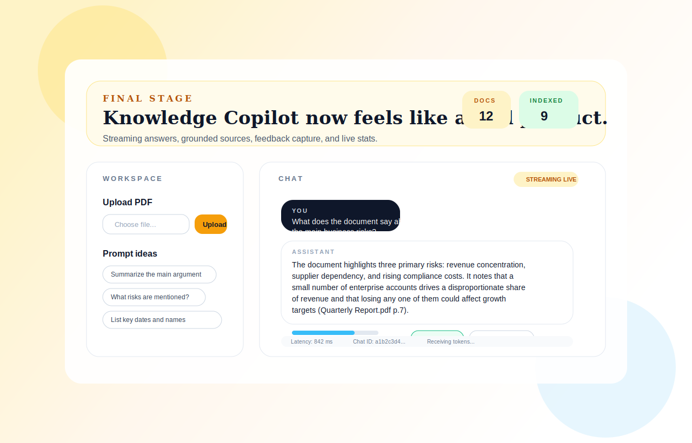
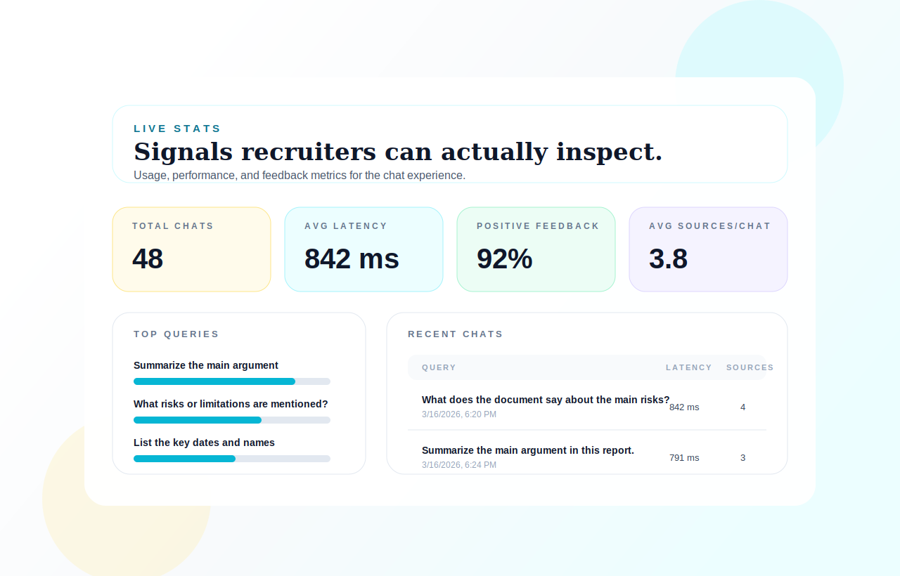

# Knowledge Copilot

Knowledge Copilot is an end-to-end RAG-style portfolio project for asking grounded questions over PDF documents.
It combines document upload and indexing, semantic retrieval, streaming answers, explicit user feedback, and a lightweight analytics dashboard.

## Preview

### Chat Experience



### Stats Dashboard



## Why this project stands out

- End-to-end product flow: upload -> index -> retrieve -> answer -> collect feedback -> inspect stats
- Grounded answers with source snippets and page citations
- Streaming UX that makes the demo feel like a real product
- Hybrid retrieval fallback with vector search plus BM25
- Portfolio-friendly observability with latency, top queries, and feedback metrics

## Stack

- Backend: FastAPI, LangChain, Chroma, Ollama
- Frontend: Next.js App Router, React, TypeScript, Tailwind CSS
- Retrieval: Chroma vector store, BM25 fallback
- Local models: Ollama chat + embeddings

## Demo Flow

1. Upload a PDF.
2. Index the document into chunks and embeddings.
3. Ask a grounded question in the chat UI.
4. Receive a streamed answer with citations and source snippets.
5. Leave `Helpful` or `Not helpful` feedback.
6. Open the Stats page to inspect latency, top queries, feedback, and usage trends.

## Repository Structure

```text
apps/
  api/
    main.py
    requirements.txt
    data/
  web/
    app/
    package.json
README.md
```

## Local Setup

### 1. Start Ollama

Install Ollama and pull the default models used by the project:

```bash
ollama pull llama3.2
ollama pull nomic-embed-text
```

### 2. Run the API

```bash
cd apps/api
python -m venv .venv
.venv\Scripts\activate
pip install -r requirements.txt
copy .env.example .env
uvicorn main:app --reload --port 8000
```

### 3. Run the web app

```bash
cd apps/web
npm install
copy .env.example .env.local
npm run dev
```

Open `http://localhost:3000`.

## Environment Variables

### API

See `apps/api/.env.example`

- `OLLAMA_CHAT_MODEL`: chat model name
- `OLLAMA_EMBED_MODEL`: embedding model name
- `API_CORS_ORIGINS`: comma-separated frontend origins

### Web

See `apps/web/.env.example`

- `NEXT_PUBLIC_API_BASE_URL`: backend base URL

## Key Features

- PDF upload and indexing
- Semantic retrieval over indexed chunks
- BM25 fallback retrieval when vector hits are weak
- Streaming answer generation
- Source snippets for answer grounding
- User feedback capture
- Stats dashboard with:
  - average latency
  - positive feedback rate
  - average sources per chat
  - top queries
  - recent chats

## Notes on Privacy

Runtime data lives under `apps/api/data/`.
Uploaded PDFs, chunks, vector indexes, and logs are gitignored so private documents are not meant to be committed to the repository.

## Possible Future Extensions

- Dockerized local setup
- Authentication and per-user document spaces
- Reranking for better retrieval quality
- Document deletion from the UI
- Automated tests for API routes and retrieval pipeline
